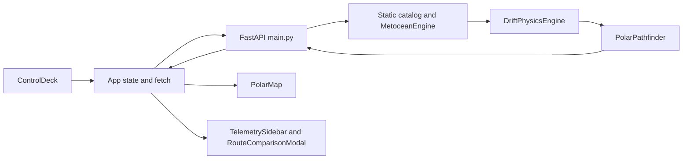

# Architecture and calculations

## Runtime flow

`main.jsx` mounts `App` in React StrictMode. `App.jsx` owns route parameters, layer visibility, response arrays and loading state. `Navbar` supplies refresh/analytics actions and a client-side UTC clock. The backend reconstructs forecasts and a navigation graph per route request. There is no shared route cache or persistent storage; the land polygon union is cached lazily in process memory.

## Module responsibilities

| Source | Responsibility |
| --- | --- |
| `backend/main.py` | Five GET handlers, query validation, CORS and route-response assembly |
| `backend/data_engine.py` | Iceberg dataclass, static catalog, stations, analytic wind/current/SIC functions |
| `backend/drift_engine.py` | Hourly propagation, snapshots, final position and buffer polygon coordinates |
| `backend/pathfinder.py` | Haversine distances, simplified land mask, navigation graph, A*, metrics |
| `frontend/src/App.jsx` | Parameters, requests, data and component composition |
| `frontend/src/components/ControlDeck.jsx` | Presets, searchable ports, manual origin and layer controls |
| `frontend/src/components/PolarMap.jsx` | Leaflet tiles, markers, lines, circles, popups and fit-to-route |
| `frontend/src/components/TelemetrySidebar.jsx` | Route metrics, loading/empty states and fixed environment readouts |
| `frontend/src/components/RouteComparisonModal.jsx` | Comparison table and model explanation |
| `frontend/src/components/Navbar.jsx` | Mission header, clock, static feed badges and actions |

## Drift model

Wind and current values come from latitude bands and trigonometric formulas. The implemented velocity is `0.88 × ocean_velocity + rotation(-18 degrees) × (0.032 × wind_velocity)`. This is a fixed rotation of the wind contribution, not a separately solved Coriolis acceleration model.

The default integrator records hourly points from 0 through 72 hours (73 records). It converts velocity to angular displacement using 111.139 km per latitude degree and a latitude-dependent longitude scale, with cosine clamped to at least 0.1.

At time `t`, the buffer is `base_buffer_km + iceberg.length_km / 2 + speed_knots × 0.12 × (t / 24)`. The polygon contains 24 sampled vertices plus the closing point. Coordinates are generated manually; imported Shapely symbols are not used for this polygon construction. `drift_distance_total_km` is approximate initial-to-final displacement, not summed trajectory length.

Snapshots include the start, 24/48 hours when reached, and the terminal step. Fields named `predicted_position_72h` contain the terminal position even when another horizon is requested.

## Routing model

The API constructs a grid at 0.85-degree resolution. The corridor extends 2.5 degrees beyond endpoint latitudes and 4.5 degrees beyond endpoint longitudes, with latitude bounds clamped to -75 and +25 degrees. Eight neighboring directions form an undirected NetworkX graph.

Grid points inside a final-position iceberg circle or one of the limited land-mask polygons have impassable cost 99,999. Other points receive a sea-ice multiplier plus a proximity penalty up to 40 within twice the hazard radius.

| Class match | Sea-ice multiplier for concentration `s` |
| --- | --- |
| PC1 | `1 + 3 × s^1.2` |
| PC3 | `1 + 8.5 × s^1.4` |
| PC7 | `1 + 25 × s^1.6` |
| Other | `1 + 80 × s^1.8` |

Edge cost is nautical distance times average endpoint cost times a current-alignment multiplier clamped to 0.85–1.20. A* uses Haversine distance as its heuristic. Exact endpoints attach to nearby accessible grid nodes. Neither ordinary edges nor endpoint connectors receive full segment-intersection checks.

If A* reports NetworkXNoPath or NodeNotFound, the engine raises NoRouteFoundError immediately. No fallback coordinates or route metrics are generated. FastAPI maps this to HTTP 409 with detail.code=NO_ROUTE_FOUND. The dashboard shows a specific no-route message and keeps results empty. Successful responses keep their existing format. This reports failure within the modeled graph, not proof that no real-world route exists.

## Metrics and coordinate conventions

Distance sums Haversine segment lengths. Effective speed is `cruising_speed × (1 - 0.25 × maximum_SIC)`. Fuel uses 36.5 tons/day and an ice-resistance factor `1 + 0.45 × maximum_SIC`. The baseline fuel calculation applies a fixed 1.35 multiplier. Reported savings are floored at 4.5%, and risk is capped at 28; these constrain results by construction.

Waypoints, trajectories and hazard coordinate arrays use **[latitude, longitude]**. They are not GeoJSON coordinates. Shapely land rings use **(longitude, latitude)**. One nautical mile is 1.852 km. API radii use kilometers; Leaflet Circle receives meters. The map uses Leaflet's default EPSG:3857 projection despite its polar label; declared projection packages are not configured.

## Route request lifecycle — updated 2026-09-14

`fetchRoute` now depends on start/end latitude and longitude, forecast hours, vessel class, buffer and speed. Loading/data updates, layers and Analytics do not refetch. Each request aborts its predecessor. Effect cleanup aborts on dependency changes or unmount. Guards after JSON parsing and in catch/finally prevent stale result/loading updates. Manual refresh works with unchanged parameters. StrictMode development may start/cancel/replace an initial request; abort may not stop server work already received. Slider changes are not debounced.

## Route error and result states — updated 2026-09-14

Starting a request clears prior route/baseline geometry, iceberg arrays and metrics. Failed HTTP/network/JSON processing displays a role=alert message and Retry. Basic response validation requires at least two finite coordinate pairs and a finite distance metric. This is a minimum usability check, not a full response-schema validator or navigation-safety check. Abort/stale-response guards from NAV-01 remain intact.

Telemetry no longer supplies fallback fixture metrics; it shows calculating/no-results text instead. Analytics displays an unavailable dialog when metrics are absent, including when a previously open report loses its results. Successful responses restore results. The sidebar badge now reads RESULTS. Other hardcoded feed/environment/baseline claims remain tracked separately in NAV-05/NAV-10.
