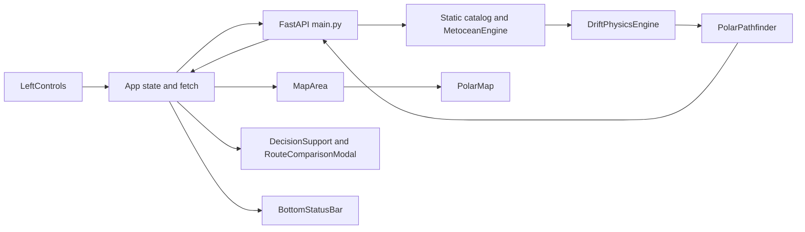

# Architecture and calculations

Reviewed 2026-09-17 against `dccfa3b`. Current behavior supersedes the restored September 14 description.

## Runtime flow

`main.jsx` mounts `App` in React StrictMode. `App.jsx` owns route parameters, layer visibility, response arrays and loading state. `Navbar` opens Analytics and displays loading/error status. `App` owns a one-second UTC clock passed to `BottomStatusBar`; the footer labels it LAST SYNC although it is not a data-sync timestamp. LeftControls supplies both full-route calculation buttons. The backend reconstructs forecasts and a navigation graph per route request. There is no shared route cache or persistent storage; the land polygon union is cached lazily in process memory.

## Module responsibilities

| Source | Responsibility |
| --- | --- |
| `backend/main.py` | Five GET handlers, query validation, CORS and route-response assembly |
| `backend/data_engine.py` | Iceberg dataclass, static catalog, stations, analytic wind/current/SIC functions |
| `backend/drift_engine.py` | Hourly propagation, snapshots, final position and buffer polygon coordinates |
| `backend/pathfinder.py` | Haversine distances, simplified land mask, navigation graph, A*, metrics |
| `frontend/src/App.jsx` | Parameters, requests, data and component composition |
| `frontend/src/components/panels/LeftControls.jsx` | Presets, port search, vessel class, horizon selector, eight layer controls and calculation buttons |
| `frontend/src/components/PolarMap.jsx` | Leaflet tiles, markers, lines, circles, popups and fit-to-route |
| `frontend/src/components/panels/DecisionSupport.jsx` | Metrics (or fixture fallback), explanation dialog, comparison, drift-speed chart and alerts |
| `frontend/src/components/panels/MapArea.jsx` | Wrapper forwarding map props to PolarMap |
| `frontend/src/components/panels/BottomStatusBar.jsx` | Mounted footer with fixed online/safety claims and client clock |
| `frontend/src/components/StatusBar.jsx` | Unused alternative footer |
| `frontend/src/components/RouteComparisonModal.jsx` | Comparison table and model explanation |
| `frontend/src/components/Navbar.jsx` | Brand, navigation placeholders, Analytics action and loading/fallback banner |

## Drift model

Wind and current values come from latitude bands and trigonometric formulas. The implemented velocity is `0.88 × ocean_velocity + rotation(-18 degrees) × (0.032 × wind_velocity)`. This is a fixed rotation of the wind contribution, not a separately solved Coriolis acceleration model.

The default integrator records hourly points from 0 through 72 hours (73 records). It converts velocity to angular displacement using 111.139 km per latitude degree and a latitude-dependent longitude scale, with cosine clamped to at least 0.1.

At time `t`, the buffer is `base_buffer_km + iceberg.length_km / 2 + speed_knots × 0.12 × (t / 24)`. The polygon contains 24 sampled vertices plus the closing point. Coordinates are generated manually; imported Shapely symbols are not used for this polygon construction. `drift_distance_total_km` is approximate initial-to-final displacement, not summed trajectory length.

Snapshots include the start, 24/48 hours when reached, and the terminal step. Fields named `predicted_position_72h` contain the terminal position even when another horizon is requested.

## Routing model

The API constructs a grid at 0.85-degree resolution. The corridor extends 2.5 degrees beyond endpoint latitudes and 4.5 degrees beyond endpoint longitudes, with latitude bounds clamped to -75 and +25 degrees. Eight neighboring directions form an undirected NetworkX graph.

Grid points inside a final-position iceberg circle or one of the limited land-mask polygons have impassable cost 99,999. Other points receive a sea-ice multiplier plus a proximity penalty up to 40 within twice the hazard radius.

| Class match | Sea-ice multiplier for concentration `s` |
| --- | --- |
| PC1 | `1 + 3 × s^1.2` |
| PC3 | `1 + 8.5 × s^1.4` |
| PC7 | `1 + 25 × s^1.6` |
| Other | `1 + 80 × s^1.8` |

Edge cost is nautical distance times average endpoint cost times a current-alignment multiplier clamped to 0.85–1.20. A* uses Haversine distance as its heuristic. Exact endpoints attach to nearby accessible grid nodes. Neither ordinary edges nor endpoint connectors receive full segment-intersection checks.

If A* reports NetworkXNoPath or NodeNotFound, the engine again interpolates 25 straight-line points and continues to success metrics, explanations and `OPTIMAL_ROUTE_COMPUTED`. Despite a comment promising a high-risk warning, the normal capped risk formula is used and no fallback marker is returned. NoRouteFoundError and the API's HTTP 409 mapping were removed in c996de7. An all-land ASGI probe reproduced HTTP 200 with 25 points and LOW risk; this is an open regression, not accepted route behavior.

## Metrics and coordinate conventions

Distance sums Haversine segment lengths. Effective speed is `cruising_speed × (1 - 0.25 × maximum_SIC)`. Fuel uses 36.5 tons/day and an ice-resistance factor `1 + 0.45 × maximum_SIC`. The baseline fuel calculation applies a fixed 1.35 multiplier. Reported savings are floored at 4.5%, and risk is capped at 28; these constrain results by construction.

Waypoints, trajectories and hazard coordinate arrays use **[latitude, longitude]**. They are not GeoJSON coordinates. Shapely land rings use **(longitude, latitude)**. One nautical mile is 1.852 km. API radii use kilometers; Leaflet Circle receives meters. The map uses Leaflet's default EPSG:3857 projection despite its polar label; declared projection packages are not configured.

## Route request lifecycle — current regression

`currentCoords` is a new object on every render and is included in `fetchRoute` dependencies. The effect depends on that callback. Loading, data, layer, dialog and one-second clock updates can therefore issue more requests even when scalar route settings are unchanged. There is no AbortController, effect cleanup, request ownership or stale-result protection. An older response can replace newer results or clear their loading state. StrictMode also replays effects in development. This source finding reopens NAV-01; no live browser timing was measured.

## Errors and result states — current regression

A request starts by setting loading and clearing only the error string. Existing arrays, metrics and explanations persist. Non-OK HTTP status, network or JSON errors set a generic simulation-mode string; Navbar displays a fallback claim without an actual local route engine. Successful bodies are assigned through `field || default` without schema validation. DecisionSupport shows sample metrics when routeMetrics is null; RouteComparisonModal falls back to an empty object and still renders fixed comparisons. NAV-06 is reopened.

## Explanation generation and chart

`xai_explanation` is calculated after routing. The primary driver is selected by whether maximum sampled SIC exceeds 0.1. Modifiers report an ice-penalty percentage and a 10-or-0 proximity flag based on a 35 km threshold. These are summaries, not a trace of alternative routes or the actual per-edge cost decomposition (the graph's proximity penalty can reach 40).

Waypoint samples use stride `max(1, len(path_nodes) // 10)`; the sample count is not capped at ten and the last waypoint is not guaranteed to be included. Each record exposes coordinates, SIC, ice penalty, current/wind speed and base cost. Missing graph attributes default to zero or one. Exact start/end nodes receive hardcoded SIC 0/0.8 and base cost 1/2; wind/current speed may be absent. A short open-water API probe showed the destination explanation reporting SIC 0.8 despite zero maximum sampled route SIC. Fallback-path points also acquire synthetic default explanations. This is not validated explainability (NAV-25).

DecisionSupport's chart averages available `snapshots[hour].speed_knots` across the iceberg catalog at 0/24/48/72 hours as applicable, then renders an SVG line/area. It represents mean drift speed, not path, forecast error or confidence. It does not show the supplied hourly trajectory series. It has a no-data state, unlike the fixture-backed metric cards. Current UI horizons are 24/48/72; `forecastHours || 72` would mislabel a future zero-hour UI selection.
